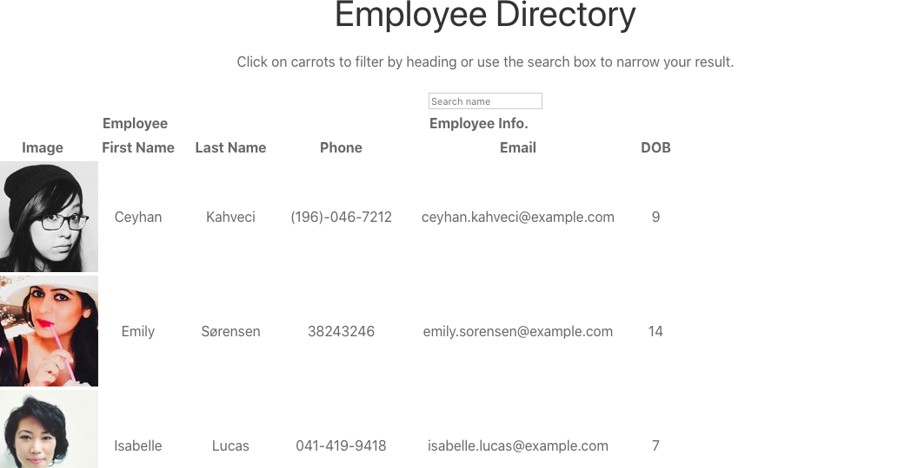

# 19 Employee Directory
`An employee directory developed with React`

In this homework assignment I created an employee directory with React. This assignment will require me to break up my  application's UI into components, manage component state, and respond to user events.

## Completed

* Rendered a table of employees each time page is reloaded
* Sort functionality by id and name

## Deployed App
[Deployed Link](https://cynthia-dm1216.github.io/EmployeeDirectory/.)

## Screenshot

